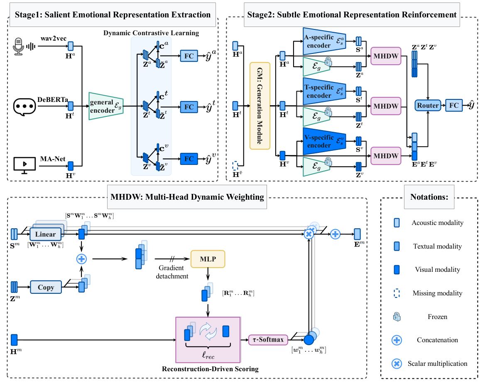

# DSSR: DECOUPLING SALIENT AND SUBTLE REPRESENTATIONS UNDER MISSING MODALITIES FOR MULTIMODAL EMOTION RECOGNITION

**Dataset**
In our paper, we use pre-extracted features. The multimodal features are available at here CMU-MOSI:[mosi](https://drive.google.com/file/d/1aJxArYfZsA-uLC0sOwIkjl_0ZWxiyPxj/view?usp=share_link), CMU-MOSEI:[mosei](https://drive.google.com/file/d/1L6oDbtpFW2C4MwL5TQsEflY1WHjtv7L5/view?usp=share_link) and IEMOCAP:[iemocap](https://drive.google.com/file/d/1Hn82-ZD0CNqXQtImd982YHHi-3gIX2G3/view?usp=share_link)

**Abstract**
Multimodal emotion recognition (MER) faces a critical challenge under missing modalities, which often yield ambiguous emotional signals. In such cases, existing attention-based methods, driven by similarity, struggle to capture discriminative yet subtle cues and are easily distracted by dominant but irrelevant signals. To address this, we propose Decoupling Salient and Subtle Representations (DSSR), a novel two-stage framework for improving emotion recognition under missing modalities. In the first stage, DSSR applies dynamic contrastive learning on full-modality data to distill modality-invariant salient representations. In the second stage, these representations are used as adaptive prompts in a multi-head dynamic weighting mechanism, guiding the model to selectively enhance the subtle emotional representations of the corresponding modality even when the modality is missing. Extensive experiments on benchmark datasets—CMU-MOSI, CMU-MOSEI, and IEMOCAP—demonstrate that DSSR achieves an overall state-of-the-art performance across various missing-modality scenarios. Case analysis further validates that DSSR’s strength lies in its ability to decouple and leverage salient and subtle emotional cues for accurate emotion recognition.

**Usage**
Prerequisites:
    1. python 3.8
        2. numpy == 1.24.4
        3. pandas == 2.0.3
        4. torch == 1.12.0+cu116
        5. torchvision == 0.13.0

commands:
    1. bash run_mosi.sh
    2. bash run_iemocap.sh
    3. bash run_mosei.sh